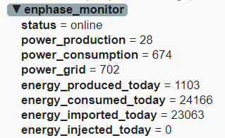

# Rapport de migration — ENPHASE V2

**Projet :** Enphase_V2  
**Source :** MSunPV_Monitor_V11_multi  
**Dernière mise à jour :** 16 février 2025 (publication MQTT Enphase, tableau config, unités)


*Schéma type de l’interface Enphase Monitor (web).*

---

## 1. Objectif de la migration

Transformer le moniteur MSunPV multi-écrans en un affichage unique Enphase :
- **Écran :** uniquement l’écran Enphase (plus MQTT, M'SunPV, etc.)
- **Web :** accès direct à la page Enphase Monitor, nettoyage progressif
- **Modules :** retrait progressif de M'SunPV, Shelly, SD, Alarme, puis intégration Home Assistant

---

## 2. Travaux réalisés

### 2.1 Écran unique Enphase

| Modification | Fichiers | Détail |
|--------------|----------|--------|
| Écran principal unique | `main.cpp`, `ui_main.h` | `screenMain` non créé, `activeScreenType = 1`, chargement direct de `screenEnphase` |
| Pas de bascule d’écran | `main.cpp` | Logique MQTT/M'SunPV/Enphase retirée pour l’affichage |

### 2.2 Module M'SunPV retiré

| Modification | Fichiers | Détail |
|--------------|----------|--------|
| Exclusion du build | `platformio.ini` | `-<module_msunpv.cpp>` dans `build_src_filter` |
| Routes, init, boucle | `main.cpp` | Routes, init, update, prefs, pages web, export, etc. |
| UI | `ui_main.h` | Callbacks, `updateMSunPVUI`, popup, badges |
| Champ IP | `module_mqtt.cpp` | Champ IP M'SunPV retiré |

### 2.3 Module Shelly retiré

| Modification | Fichiers | Détail |
|--------------|----------|--------|
| Exclusion du build | `platformio.ini` | `-<module_shelly.cpp>` dans `build_src_filter` |
| Routes, init, prefs | `main.cpp` | `/shellies`, `/shellyData`, etc. |
| UI | `ui_main.h` | Suppression `led_shelly`, labels Shelly, etc. |

### 2.4 Module carte SD retiré

| Modification | Fichiers | Détail |
|--------------|----------|--------|
| Exclusion du build | `platformio.ini` | `-<module_sd.cpp>` |
| Stats | `module_stats.cpp` | Suppression des appels SD, `stats_loadFromSD()` retourne `false` |

### 2.5 Module Alarme retiré

| Modification | Fichiers | Détail |
|--------------|----------|--------|
| Route et handler | `main.cpp` | Suppression `/alarm/set` |
| Module MQTT | `module_mqtt.cpp` | Suppression topics alarme, subscribe, parse |

### 2.6 Module MQTT – entrées retirées, broker simplifié, publication Enphase

| Modification | Fichiers | Détail |
|--------------|----------|--------|
| Présences (Ben, Francine, Victor) | `module_mqtt.cpp/h`, `main.cpp` | Variables, parse, subscribe, formulaire retirés |
| Souscriptions MQTT | `module_mqtt.cpp` | Toutes les `subscribe()` supprimées (hors outil écoute test) |
| Parsing entrant | `module_mqtt.cpp` | `parseMqttMessage()` vidé |
| Page Config MQTT | `module_mqtt.cpp` | Broker (IP, port, user, pass) + **Publication Enphase** (préfixe, intervalle) — route `/mqtt` |
| User/Pass en NVS | `module_mqtt.cpp`, `config.h` | `config_mqtt_user`, `config_mqtt_pass` configurables depuis le web |
| Connexion optionnelle | `module_mqtt.cpp` | Si IP vide → pas de tentative de connexion |
| Config MQTT accessible | `main.cpp` | Lien Réglages et Enphase Monitor → `/mqtt`. mqtt_loop() toujours actif, outil écoute et diagnostic. |
| **Publication Enphase** (fév. 2025) | `module_mqtt.cpp` | Publication périodique des valeurs Enphase (puissances W, énergies Wh, status) sur topics `<prefixe>/*` ; préfixe et intervalle (5–300 s) configurables ; LWT sur `<prefixe>/status` ; tableau de contrôle sur la page MQTT (topic, valeur Enphase, unité). Endpoint `/mqttPublishData` pour le tableau. |

Exemple de vue des topics dans **MQTT Explorer** (préfixe `enphase_monitor`) :



### 2.7 Page d’accueil et données

| Modification | Fichiers | Détail |
|--------------|----------|--------|
| Redirection `/` | `main.cpp` | Redirection 302 vers `/enphase-monitor` |
| Stats | `module_stats.cpp` | Utilisation de `enphase_pact_prod` et `enphase_pact_conso` (module_enphase) |
| Carte CONSO (W) alignée LVGL | `main.cpp` | Page Enphase Monitor : carte Conso = `enphase_pact_grid` (flux réseau), alignée avec flux Maison↔Réseau et écran LVGL |
| Endpoint `/data` | `main.cpp` | Champ `conso` utilise `enphase_pact_grid` |

### 2.8 Verrouillage MDP supprimé

| Modification | Fichiers | Détail |
|--------------|----------|--------|
| Variables et routes | `main.cpp` | Suppression `screenLockEnabled`, `screenLockPassword`, `unlockToken`, `unlockExpiry` |
| Routes | `main.cpp` | Suppression `/unlockScreen`, `/saveScreenLock` |
| Page Réglages | `main.cpp` | Suppression modal MDP « Compte DEV », lien direct « Accueil complet » |
| Page Info | `main.cpp` | Suppression bloc « Verrouillage Enphase » (checkbox, MDP) |
| Page Screens | `main.cpp` | Suppression formulaire déverrouillage, affichage direct de la sélection d’écran |
| Préférences | `main.cpp` | Suppression load/save `PREF_SCREEN_LOCK_*` |
| Export/Import | `main.cpp` | Suppression des clés verrouillage |

---

## 3. Erreurs à ne pas reproduire

### 3.1 Nettoyage du cache après exclusion de modules

Après modification de `build_src_filter` : exécuter `pio run -t clean` puis `pio run -j 1`.

### 3.2 Dépendances entre modules exclus et modules restants

Avant d’exclure un module : retirer toutes les références (fonctions, variables) dans les autres fichiers.

### 3.3 Compilation ESP32 et mémoire

Sous Windows : utiliser `pio run -j 1` pour éviter les erreurs de mémoire.

### 3.4 Compilation : l’assistant ne compile pas

L’assistant **ne lance pas la compilation** après ses modifications. L’utilisateur compile et uploade avec VS Code / PlatformIO. Pas de `pio run` ni `pio run -t upload` exécutés par l’assistant.

---

## 4. Configuration actuelle (platformio.ini)

```ini
build_src_filter = +<*> -<weather_icons_NEW.cpp> -<module_msunpv.cpp> -<module_sd.cpp> -<module_shelly.cpp>
```

---

## 5. Prochaines étapes

### 5.1 MQTT — résolu (février 2025)

**Corrections appliquées :**

- **Aucun accès pour saisir les paramètres MQTT** : l’utilisateur ne trouve plus d’endroit pour entrer ou modifier l’IP du broker, le port, l’utilisateur et le mot de passe.
- **Connexion impossible** : avec les paramètres déjà enregistrés en NVS, la connexion au broker ne fonctionne pas.

**À faire :**

1. **Rendre la page Config MQTT visible et accessible** : s’assurer qu’un lien clair mène vers `/mqtt` (par ex. depuis la page Réglages ou depuis la page principale Enphase Monitor). Vérifier que le chemin est correct et que la page s’affiche.
2. **Diagnostiquer la connexion** : comprendre pourquoi la connexion échoue avec les paramètres sauvegardés (IP, port, user, pass). Vérifier les logs `[MQTT]`, le code d’erreur PubSubClient, et la cohérence entre NVS et les valeurs utilisées par `mqtt_reconnect()`.

### 5.2 Page réglages Web Server

#### 5.2.1 Page Info — état des connexions

Créer ou adapter une page Info centralisant les informations de connexion :

| Composant | Affichage |
|-----------|-----------|
| WiFi | État de connexion (SSID, IP, RSSI, etc.) |
| MQTT | État de connexion au broker |
| Enphase | État de connexion à l’Envoy |
| Tempo | Deux badges colorés selon l’information EDF Tempo : couleur du jour (rouge/blanc/bleu) et couleur du lendemain ; vert pour « demain » si l’info n’a pas encore été reçue entre minuit et l’heure d’acquisition. Vérifier le comportement du module Tempo (horaire d’appel API Tomorrow), adapter la logique des badges et afficher l’heure d’acquisition de la couleur « demain ». |

#### 5.2.2 Config Envoy — bouton « Configuration »

- **Actuel :** le lien « Config Envoy » depuis Réglages pointe correctement vers `/enphase?from=enphase`. Le lien « Configuration » (ailleurs sur la page) pointe vers une URL incorrecte.
- **À faire :** soit réutiliser les popups de configuration Envoy existantes (4 paramètres : IP, user, pwd, serial), soit proposer une popup unique contenant les 4 champs. Un clic sur « Configuration » doit ouvrir une popup ou une page dédiée pour saisir les 4 paramètres sans erreur de chemin.

#### 5.2.3 Réglages WiFi — scan réseaux

- **Actuel :** l’option de scan des réseaux WiFi n’est pas visible ou pas accessible lorsque l’ESP32 est déjà connecté.
- **À faire :** toujours proposer un bouton ou une section « Scan » pour lister les réseaux et changer de WiFi.
- **À vérifier :** le mode AP (point d’accès) fonctionne correctement — ne pas modifier cette partie.

### 5.3 Publication Enphase vers Home Assistant

- MQTT Discovery (auto-découverte des entités dans HA)
- Publier : prod, conso, prod/conso du jour, statut

### 5.4 Optionnel

- Publication météo vers HA
- Publication des stats vers HA (à décider plus tard)

---

## 6. Connexion MQTT – dépannage

**Accès à Config MQTT :**

- Enphase Monitor → Réglages → Config MQTT → /mqtt. Ou page Info → Configurer MQTT (page Info = lien Configurer MQTT), c’est un bug Configurer MQTT depuis page Info.

**Si la connexion au broker échoue :**

1. Vérifier IP, port (1883), utilisateur et mot de passe sur la page Config MQTT.
2. Sauvegarder et laisser l’ESP32 redémarrer.
3. Consulter les message d'erreur affiché sur la page Config MQTT. 4. Utiliser l'outil Test ecoute MQTT (code d’erreur , topic ex. shellies/#, cliquer Ecouter.
5. Si IP vide : connexion MQTT désactivée (optionnel).
